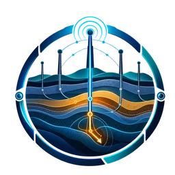
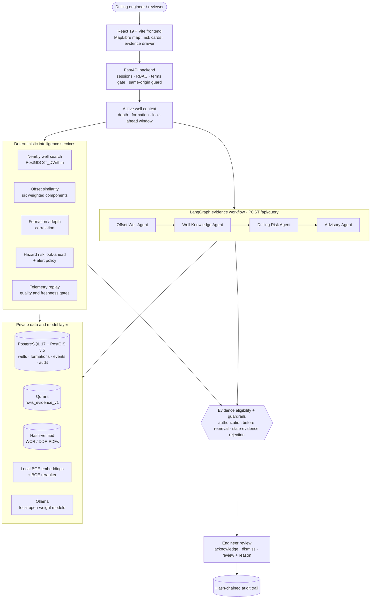
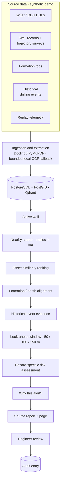
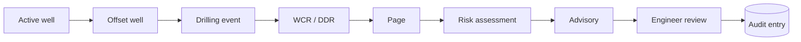
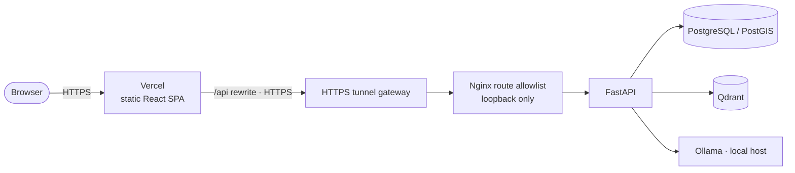

<div align="center">



# eRTMAC-NWIS

### AI-Powered Nearby Wells Intelligence & Drilling Decision Support

> **eRTMAC sees the live well. NWIS remembers what nearby wells learned.**


| Problem Statement | Organization | Category | Team |
| :---: | :---: | :---: | :---: |
| **SIH26121** | Oil India Limited | Smart Automation | **Code Synapse2** |

</div>

> [!IMPORTANT]
> **Prototype scope.** The demonstrator runs entirely on a **synthetic demo dataset** (not Oil India data). Risk scores are **uncalibrated prototype estimates**. NWIS is **advisory-only**: it never controls the rig or changes drilling parameters, and the engineer remains the decision-maker. Telemetry is **replayed/simulated**, not a live eRTMAC feed.

---

## Contents

[Problem](#-problem) · [Solution](#-proposed-solution) · [Architecture](#%EF%B8%8F-system-architecture) · [Workflow](#-end-to-end-workflow) · [Core intelligence](#-core-intelligence) · [Offset similarity](#-offset-well-similarity) · [Risk look-ahead](#-risk-look-ahead) · [Traceability](#-evidence-traceability) · [AI / RAG / agents](#-ai-rag-and-agentic-architecture) · [Stack](#-technology-stack) · [Security](#-security-and-data-sovereignty) · [Application](#%EF%B8%8F-application-pages) · [Metrics](#-validated-prototype-metrics) · [Golden demo](#-golden-demo-scenario) · [Local development](#%EF%B8%8F-local-development) · [Repository](#-repository-structure) · [Deployment](#-deployment) · [Limitations](#%EF%B8%8F-limitations) · [References](#-references-and-ecosystem-alignment)

---

## 🧭 Problem

Historical drilling knowledge — **Well Completion Reports (WCRs)**, **Daily Drilling Reports (DDRs)**, well records, formation tops and drilling events — is spread across documents and data systems. While drilling, an engineer needs fast answers to:

- Which nearby wells are **actually relevant** to the current well?
- What happened in the **same formation and depth interval**?
- Which **hazards** (stuck pipe, mud loss, kicks, torque/drag…) occurred there?
- What **evidence** supports an alert — which report, which page?

**Distance alone is insufficient.** The closest well can be drilled through a different formation, at a different depth, with a different trajectory or mud program.

## 💡 Proposed Solution

NWIS gives eRTMAC a searchable, explainable **offset-well memory**:

```text
Active Well Context → Nearby Well Discovery → Offset Similarity → Formation/Depth Correlation
  → Historical Evidence Retrieval → Risk Look-Ahead → Evidence-Grounded Advisory
  → Engineer Review → Audit Trail
```

Every number shown to the engineer is traceable to a source record, and every review decision is written to a hash-chained audit log.

---

## 🏗️ System Architecture



## 🔄 End-to-End Workflow



---

## 🧠 Core Intelligence

| Capability | What it does |
| --- | --- |
| **Nearby Well Intelligence** | Indexed radius search (`geography(Point,4326)`, GiST index, `ST_DWithin`) returning offsets with raw distances. |
| **Offset Similarity** | Ranks offsets by six explainable component scores, not by distance alone. Unknown components stay `null`. |
| **Formation / Depth Correlation** | Aligns active and offset formation intervals and events on one axis; MD, TVD and TVDSS are kept distinct and never extrapolated. |
| **Drilling Event Intelligence** | Source-backed event search by well, formation, hazard type and depth range; reviewers can validate or reject extracted events. |
| **Risk Look-Ahead** | Deterministic, hazard-specific exposure score for the next 50 / 100 / 150 m, with separate confidence and an alert policy with hysteresis. |
| **Evidence Retrieval** | Structured retrieval, or hybrid dense + sparse retrieval on Qdrant with reciprocal-rank fusion and cross-encoder reranking. |
| **Telemetry Replay** | Bounded time-window telemetry across 10 channels; reviewers can seek a synthetic timestamp. Labelled as replay, never live. |
| **Knowledge Search** | Durable four-agent LangGraph workflow that answers questions with cited event / report / page evidence, or says evidence is insufficient. |
| **Engineer Advisory** | Advisory queue with acknowledge / dismiss / review decisions that require a reason. |
| **Audit & Governance** | Role-based access, advisory-terms gate and a tamper-evident, hash-chained audit log of assessments, queries, replays and reviews. |

## 📐 Offset-Well Similarity

**Nearest well ≠ best analog.** Default weights (from [`docs/nwis/README.md`](docs/nwis/README.md)):

| Component | Weight | How it is scored |
| --- | :---: | --- |
| Geographic proximity | 0.15 | `exp(-distance_m / 5000)` |
| Formation match | 0.30 | Unambiguous canonical formation match |
| Depth overlap | 0.20 | Overlap of the active look-ahead interval with the matching offset formation (prefers TVDSS → TVD → MD) |
| Trajectory | 0.15 | Inclination comparison |
| Drilling program | 0.10 | Available mud / hole / casing attributes |
| Data quality | 0.10 | Penalises weaker data, e.g. MD-only comparison |

Weights are configurable via `NWIS_OFFSET_WEIGHTS` and normalised. They are **prototype engineering choices, not learned or calibrated coefficients**.

In the golden scenario, **`OFF-01` is the closest well (~149 m)** but is less relevant than the formation-matched **`OFF-04`, the strongest analog** ([demo runbook](docs/nwis/demo_runbook.md)).

## 📈 Risk Look-Ahead

Risk probability is **computed deterministically by the backend. It is never generated by an LLM.**

```text
similarity-weighted offset event prevalence   (historical evidence)
+ bounded telemetry anomaly modifier (≤ 0.15, quality- and freshness-gated, 3-sample persistence)
→ hazard-specific exposure score  +  separate confidence
```

| | Meaning |
| --- | --- |
| **Probability** | Heuristic exposure score per hazard, returned with `calibrated=false`. `null` when no usable offsets exist. |
| **Confidence** | How much to trust that score: analog count, data quality, evidence confidence, telemetry availability, contradictions and depth basis. |

**Alert policy:** score ≥ 0.6, confidence ≥ 0.5, at least two supporting wells, and three successive assessments. Clears below 0.4, 30-minute cooldown, serialized per well. Supported look-ahead windows: **50, 100 and 150 m**.

> [!NOTE]
> All risk values are **uncalibrated prototype estimates** on synthetic data, not validated field-event probabilities.

## 🔗 Evidence Traceability



Source PDFs are stored by hash and served through an authorized, hash-verified endpoint (`GET /api/reports/{id}/source`), so the **"Why this alert?"** drawer opens the exact report page behind each contributing event. Example chain from the release audit: `EVT-00b7…` → `OFF-04-DDR` → **page 5**.

## 🤖 AI, RAG and Agentic Architecture

| Component | Implementation |
| --- | --- |
| **Agent orchestration** | LangGraph with four NWIS nodes: **Offset Well Agent → Well Knowledge Agent → Drilling Risk Agent → Advisory Agent**, reusing SQL checkpoints and execution locks. Checkpoint replay re-authorizes evidence. |
| **Retrieval** | `structured` (relational, no model artifacts needed) or `hybrid`: local **BGE** dense embeddings + sparse encoding in **Qdrant**, **reciprocal-rank fusion** and **BGE cross-encoder reranking**. |
| **Model runtime** | **Ollama** with local open-weight models (Qwen family configured). No hosted inference API is used. |
| **Document processing** | Docling / PyMuPDF native extraction with a bounded local OCR fallback; a conservative extractor keeps uncertain text for human review. |

**Clear separation of responsibilities**

| LLM / agent layer | Deterministic backend |
| --- | --- |
| Evidence explanation and knowledge interaction | Similarity scoring |
| Agent reasoning and orchestration of the evidence workflow | Risk probability and confidence |
| | Alert policy (thresholds, persistence, cooldown) |
| | Evidence eligibility and authorization |

> The current advisory text uses a **deterministic, cited template** and records that route honestly. It does not claim a Qwen generation it did not make, and it can return *insufficient evidence*.

## 🧰 Technology Stack

| Layer | Technology |
| --- | --- |
| Frontend | React 19, Vite 7, React Router, MapLibre GL, GSAP |
| Backend API | FastAPI, SQLAlchemy 2, Alembic, Python 3.11 |
| Agent orchestration | LangGraph |
| LLM runtime | Ollama (local, open-weight) |
| Embeddings / reranking | BAAI `bge-base-en-v1.5`, `bge-reranker-base` (local) |
| Vector retrieval | Qdrant 1.17 |
| Relational / spatial DB | PostgreSQL 17 + PostGIS 3.5 |
| Document processing | Docling, PyMuPDF, local OCR fallback |
| Auth | Argon2id passwords, opaque DB sessions, email OTP verification / recovery |
| Packaging | Docker Compose, Nginx route-allowlist gateway |
| Demo hosting | Vercel (static frontend) → HTTPS tunnel gateway → private backend |

## 🔐 Security and Data Sovereignty

- **Local inference.** Open-weight models via Ollama plus local BGE artifacts, with no hosted model APIs.
- **Private data plane.** PostgreSQL / PostGIS and Qdrant sit on an internal Docker network with no host-published ports. Ollama stays host-local and is never tunnelled.
- **Access control.** Requester / reviewer / admin roles, restricted wells are admin-only, and an advisory-terms acceptance gate applies.
- **Sessions.** Opaque database-backed, HttpOnly, Secure, SameSite=Lax cookies; same-origin guard on browser writes; no wildcard CORS.
- **Tamper-evident audit.** A hash chain covers terms acceptance, assessments, replays, queries and advisory reviews.
- **Human-in-the-loop.** Reviews capture user, time, reason and evidence IDs. **Approval never invokes equipment, and there is no autonomous drilling control.**

## 🖥️ Application Pages

| Area | Pages |
| --- | --- |
| Overview | **Dashboard**, **Nearby Wells Map** |
| Wells | **Well Catalogue**, **Active Well** (well cockpit), **Offset Analysis**, **Formation Correlation** |
| Intelligence | **Drilling Events**, **Risk Look-Ahead** (with *Why this alert?*), **Live Drilling** (replay), **Knowledge Search** |
| Governance | **Advisories**, **Audit** |
| Support | **Help & Resources** |

Public landing page, sign-in / sign-up, email verification and password recovery are also included.

## ✅ Validated Prototype Metrics

All figures come from committed validation records, on **synthetic data in a local Docker environment**:

| Metric | Result | Source |
| --- | --- | --- |
| Final release backend tests | **200 distinct tests passed**, 0 failed / skipped | [final_release_report.md](docs/nwis/final_release_report.md) |
| E1 backend / security audit | **148 passed**, 0 unresolved | [e1_release_audit.md](docs/nwis/e1_release_audit.md) |
| NWIS development benchmark | **46 / 46 passed** | [validation.md](docs/nwis/validation.md) |
| Held-out benchmark (one-time, no retries) | **8 / 8 passed** | [final_release_report.md](docs/nwis/final_release_report.md) |
| Golden end-to-end HTTP flow | **63 API checks + 10 PDF / hash checks** passed | [final_release_report.md](docs/nwis/final_release_report.md) |
| Frontend unit tests | **51 passed** | [final_release_report.md](docs/nwis/final_release_report.md) |
| Repeat-run median latency | Risk (100 m) **~0.34 s** · Nearby **~0.26 s** · Correlation **~0.30 s** | [c2_validation.md](docs/nwis/c2_validation.md) |

<details>
<summary>What these numbers do <b>not</b> mean</summary>

Benchmark cases are developer-authored functional tests. They do not measure field calibration or performance on independently collected Oil India data. Latencies are local sanity measurements, not throughput guarantees. Hybrid knowledge queries are slower on CPU (warm medians of a few seconds).
</details>

## 🎯 Golden Demo Scenario

```text
ACTIVE-01 → nearby search → OFF-01 closest → OFF-04 strongest analog → formation/depth correlation
  → 100 m stuck-pipe look-ahead → evidence → source report + page → advisory
  → engineer acknowledgement → audit
```

Stuck-pipe score in the recorded release run: **≈ 0.75 (uncalibrated)**, confidence **0.855**. Replaying 15:58 → 15:59 → 16:00 raises advisories only on the third successive assessment, as the persistence rule requires. Step-by-step: [demo runbook](docs/nwis/demo_runbook.md).

---

## 🛠️ Local Development

**Prerequisites:** Docker Desktop, Node.js (for the frontend), and optionally local BGE model artifacts for hybrid retrieval.

<details open>
<summary><b>1. Backend stack (PostGIS, Qdrant, FastAPI)</b></summary>

```sh
docker compose -f infra/docker-compose.nwis.yml build backend
docker compose -f infra/docker-compose.nwis.yml up -d postgres qdrant
docker compose -f infra/docker-compose.nwis.yml run --rm --no-deps backend python -m alembic -c backend/alembic.ini upgrade head
docker compose -f infra/docker-compose.nwis.yml run --rm --no-deps backend python -m scripts.seed_nwis --generate
docker compose -f infra/docker-compose.nwis.yml run --rm --no-deps backend python -m scripts.seed_nwis
docker compose -f infra/docker-compose.nwis.yml run --rm --no-deps backend python -m scripts.seed_dev_users
docker compose -f infra/docker-compose.nwis.yml up -d backend
```

The API listens on `127.0.0.1:8011` (OpenAPI at `/docs`). `seed_dev_users` creates **local-only** requester / reviewer test identities, described in [`docs/nwis/README.md`](docs/nwis/README.md).
</details>

<details>
<summary><b>2. Accounts, email OTP and hybrid retrieval (optional)</b></summary>

- Copy `infra/nwis-auth.env.example` to `infra/.env` (git-ignored) and set `NWIS_AUTH_SECRET`. Codes go to a local Mailpit inbox by default.
- For hybrid retrieval, set `NWIS_MODEL_DIR` to a directory containing `bge-base-en-v1.5` and `bge-reranker-base`, then index:

```sh
docker compose -f infra/docker-compose.nwis.yml run --rm --no-deps backend python -m scripts.seed_nwis --index
```
</details>

<details>
<summary><b>3. Frontend</b></summary>

```sh
cd frontend
npm ci
WORKBENCH_API_PROXY=http://127.0.0.1:8011 npm run dev   # http://localhost:5173
```

In PowerShell, run `$env:WORKBENCH_API_PROXY='http://127.0.0.1:8011'` first. Other scripts: `npm test`, `npm run lint`, `npm run build`.
</details>

<details>
<summary><b>4. Validation</b></summary>

```sh
docker compose -f infra/docker-compose.nwis.yml run --rm --no-deps -e NWIS_TEST_POSTGRES=1 backend python -m unittest discover -s backend/tests -p 'test_nwis*.py' -v
docker compose -f infra/docker-compose.nwis.yml run --rm --no-deps backend python -m scripts.benchmark_nwis
docker compose -f infra/docker-compose.nwis.yml run --rm --no-deps backend python -m alembic -c backend/alembic.ini check
```
</details>

> Never commit real secrets. Environment files (`.env`, `infra/.env`) are git-ignored.

## 📁 Repository Structure

```text
ertmac-nwis/
├── backend/
│   ├── app/
│   │   ├── agents/          # LangGraph graph, NWIS agent nodes, evidence/citation guards
│   │   ├── api/             # FastAPI routes (NWIS, auth, audit)
│   │   ├── services/        # nwis.py (similarity, risk), nwis_knowledge.py, nwis_telemetry.py
│   │   └── db/              # SQLAlchemy models
│   ├── alembic/             # database migrations
│   ├── scripts/             # seed_nwis, seed_dev_users, benchmark_nwis, smoke tests
│   └── tests/               # unit, PostGIS, retrieval and security suites
├── frontend/                # React + Vite application (src/features/nwis, landing, auth)
├── benchmark/nwis/          # 46 development + 8 held-out cases
├── data/nwis_demo/          # synthetic dataset and generated WCR/DDR PDFs
├── docs/nwis/               # runbook, API contracts, validation and release records
├── infra/                   # Docker Compose, Dockerfile, release gateway (nwis-release/)
└── README.md
```

## 🚀 Deployment

**Hackathon demo deployment**



Only the gateway API is exposed through the tunnel. The database, vector store and model runtime stay private. This setup carries **synthetic demo data only**, and it is **not** the proposed production architecture. See [deployment_preflight.md](docs/nwis/deployment_preflight.md) and [production_config.md](docs/nwis/production_config.md).

**Target Oil India / enterprise deployment:** the same containers on **on-premise or private infrastructure** inside the operator's network. Data, vector index and open-weight models remain within the organisation's boundary, with no public tunnel and no hosted inference.

## ⚠️ Limitations

- Synthetic demo dataset: 12 wells, 48 formation intervals, 66 events in 11 reports, 610 telemetry samples.
- Telemetry is replayed/simulated. The WITSML interface is a local-replay adapter boundary, and live **WITSML / ETP** transport is a future integration path.
- Risk scores are heuristic and **uncalibrated**. There is no trained hazard classifier and no claimed NPT reduction.
- No closed-loop or automatic rig control.
- Production eRTMAC integration and OSDU services are not demonstrated.
- Similarity/risk evaluates the active canonical formation; multi-formation transition forecasting and datum reconciliation need validated field data.
- The event extractor is conservative, not a trained drilling NER model. OCR values need review before they become evidence.
- Queries are bounded (e.g. ≤ 500 radius candidates, telemetry windows ≤ 24 h).

## 📚 References and Ecosystem Alignment

- **Oil India Limited — eRTMAC** (Real-Time Monitoring & Analysis Centre): the live-well context NWIS complements.
- **DGH National Data Repository (NDR)**: the national source of well and E&P data NWIS is designed to draw on.
- **Energistics WITSML / ETP**: the standard real-time drilling data transport targeted by the telemetry adapter boundary.
- **OSDU Data Platform**: the open subsurface data platform for future enterprise integration.
- Project specification: [eRTMAC-NWIS master report (SIH26121)](docs/nwis/reference/eRTMAC_NWIS_Master_Report_SIH26121.pdf).

<details>
<summary>Project history</summary>

This repository evolved from an earlier on-premise agentic AI workbench, whose auth, audit chain, retrieval and LangGraph infrastructure NWIS reuses. Earlier phase documentation remains under `docs/` as historical reference; the NWIS product documentation lives in [`docs/nwis/`](docs/nwis/README.md).
</details>

---

<div align="center">

> **eRTMAC sees the live well. NWIS remembers what nearby wells learned.**

**Team Code Synapse2 · Smart India Hackathon 2026 · SIH26121**

</div>
