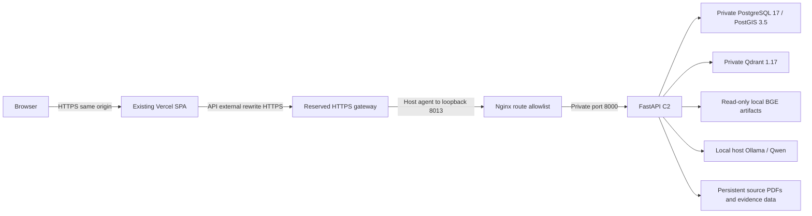

# NWIS D2 deployment preflight

Prepared 2026-09-30. This is a release plan, not a deployment record. No release services, tunnel, Vercel upload, push or merge were performed. Claude's D1 visual commit remains pending.

## Release inputs and source isolation

| Component | Accepted source |
| --- | --- |
| Frozen B2 | `70f90606346e81c4c36f916be967a2d4cecc541a` |
| Backend with C2 hardening | `e988cc36b3c7f3e9b14b5d7f2ace58335d34e705` |
| Integrated frontend baseline | `579de878f5edf9d1e76545cc11e939750e751266` |
| Final frontend | Claude D1 SHA, still required; must descend from the baseline |
| D2 worktree / branch | `C:\Users\Lohith k\Desktop\ertmac-nwis-d2` / `release/nwis-d2-preflight` |

D2 starts from C2. Its root `frontend/` is NOT the integrated frontend. `prepare_release.py` exports only committed frontend files from the accepted D1 SHA into ignored `data/nwis-release/<full-sha>/frontend`, adds the production Vercel configuration, and records both backend and frontend SHAs in `release.json`. It rejects the baseline as a final D1 candidate and never copies working-tree credentials or links/deploys a project. Do not deploy the D2 root or the old Vercel worktree. No application/API/risk changes are part of D2.

## Final topology



The selected plan retains `https://sovereign-ai-workbench-nine.vercel.app`. Only the gateway API is exposed through the tunnel. Compose publishes only `127.0.0.1:8013`; PostgreSQL, Qdrant and FastAPI have no host-published ports. PostgreSQL and Qdrant use an internal Docker network. Ollama stays on the host, reachable from Docker through `host.docker.internal:11434`; restrict host firewall access to local/Docker clients, never tunnel or port-forward it. The model hostname is explicitly allowlisted by B2.

Vercel serves React/Vite static assets, not Python, models or persistent storage. Embeddings/reranking use local BGE; Qwen uses local Ollama. No proprietary hosted inference is introduced. Vercel and the gateway provider transport synthetic demo data: this is not an air-gapped or confidential-data deployment.

## Existing Vercel state and required changes

Read-only inspection found the old detached deployment worktree at `831c149`, project `sovereign-ai-workbench`, scope `loktrishal-05s-projects`, project ID `prj_2hYgv3Mhd767OgT8m3dx0kdJ3hjT`. Its local deployment note says CLI deployment with Git integration disconnected; dashboard state still needs operator verification. Its configuration has only the SPA fallback, and no backend rewrite. On 2026-09-30 the permanent URL returned HTML 200 for `/` and `/login`, but `/api/health` returned 404. No local tunnel was reachable. Token values were neither read nor copied.

Replace that old build with the accepted D1 frontend export. Use the included Vercel template, relative `/api`, fixtures disabled, `npm ci`, production build and `verify:dist`. The template explicitly substitutes a reserved gateway origin; Vercel dashboard variables are not assumed to interpolate JSON rewrites. Remove any conflicting dashboard build/root overrides and stale absolute `VITE_API_BASE_URL`. Link only the prepared frontend directory to the existing project.

The `/api/:path*` external rewrite must precede the SPA fallback and retain `/api`. API responses disable browser/CDN caching, including explicit rewrite-cache opt-out. Vercel documents external rewrites and their cache controls in [Rewrites](https://vercel.com/docs/routing/rewrites).

## Routing and expected public behavior

| Public request | Upstream FastAPI path / expected behavior |
| --- | --- |
| `/`, `/login`, SPA deep link/refresh | Vite `index.html`, HTML 200 |
| `/api/health` | `/health`, JSON 200 |
| `/api/ready` | `/ready`, JSON 200 ready or 503 degraded |
| `/api/auth/login`, `logout`, `me`, `capabilities`, `sessions/...` | Strip `/api`, retain `/auth/...` |
| `/api/wells`, `events`, `query`, `assessments`, `advisories`, `terms`, `reports` and their children | Retain `/api` exactly |
| `/api/audit` | Retain `/api/audit` |
| `/api/audit/verify` | `/audit/verify` |
| `/api/reports/OFF-04-DDR/source#page=1` | Authenticated PDF; fragment selects page in browser |
| Unauthenticated protected API | JSON 401, never HTML SPA fallback |
| Unknown API, admin, ingestion, signup/recovery, docs/OpenAPI, legacy request APIs | Gateway JSON 404 |

Query strings survive forwarding. Nginx preserves the incoming Origin, Referer, Cookie and Set-Cookie. Do not globally remove `/api`: that breaks the frozen NWIS routes. Do not use the Vite development proxy in production. Backend source URLs already point to `/api/reports/...`; no page-link rewrite is needed.

## Environment and secrets

Copy `infra/nwis-release/release.env.example` to an operator-protected path outside any upload directory. Do not commit the filled file or print `docker compose config` with resolved secrets. Generate separate URL-safe random secrets (for example 32 random bytes encoded as 64 hexadecimal characters).

| Operator input | Required value |
| --- | --- |
| `NWIS_DB_OWNER_PASSWORD` | Unique migration-owner/database bootstrap secret |
| `NWIS_DB_PASSWORD` | Different application database secret |
| `NWIS_BACKEND_IMAGE` | Unique backend image tag, initially `ertmac-nwis-release:e988cc36`; record image ID/digest |
| `NWIS_MODEL_DIR` | Absolute existing model root containing `bge-base-en-v1.5` and `bge-reranker-base` |
| `NWIS_PUBLIC_ORIGIN` | `https://sovereign-ai-workbench-nine.vercel.app`, no trailing slash |
| `NWIS_GATEWAY_ORIGIN` | Reserved public HTTPS DNS origin; required by artifact preparation, not passed to FastAPI |
| Demo reviewer password | Hidden prompt during provisioning/login; do not place in frontend or source control |
| Vercel / tunnel operator credentials | Operator credential store only; never `VITE_*` or backend account credentials |

The Compose file supplies these exact runtime names (B2's prefixed names matter):

| Runtime variable | Release value |
| --- | --- |
| `DATABASE_URL` | PostgreSQL psycopg URL for `nwis_app`, private `postgres:5432/nwis`; migration service alone uses `nwis_owner` |
| `QDRANT_URL` | `http://qdrant:6333` |
| `MODEL_RUNTIME`, `MODEL_NAME`, `PRIMARY_MODEL` | `ollama`, `qwen3.5:9b`, `qwen3.5:9b` |
| `MODEL_BASE_URL`, `MODEL_ALLOWED_HOSTS` | `http://host.docker.internal:11434`, `host.docker.internal` |
| `WORKBENCH_DEPLOYMENT_MODE`, `WORKBENCH_SIGNUP_MODE` | `public`, `disabled` |
| `WORKBENCH_CORS_ORIGINS` | JSON array with only the exact public frontend origin |
| `WORKBENCH_AUTH_FRONTEND_ORIGIN` | Same exact public frontend origin |
| `SESSION_COOKIE_SECURE`, `SESSION_COOKIE_NAME`, `SESSION_TTL_SECONDS` | `true`, `workbench_session`, `28800` |
| `WORKBENCH_AUTH_SECRET` | Deliberately empty: this enables no recovery flow; it is not a session-signing key |
| `WORKBENCH_GOOGLE_ENABLED`, `WORKBENCH_SMTP_HOST`, `WORKBENCH_SMTP_SENDER` | `false`, empty, empty |
| `WORKBENCH_DATA_ROOT`, `WORKBENCH_MODEL_ROOT` | `/workbench/data`, `/workbench/models` |
| `HF_HUB_OFFLINE`, `TRANSFORMERS_OFFLINE`, `HF_HOME` | `1`, `1`, `/tmp/huggingface` |
| `OMP_NUM_THREADS`, `MKL_NUM_THREADS` | `2`, `2` |
| Frontend `VITE_API_BASE_URL`, `VITE_NWIS_FIXTURES` | `/api`, `0` (embedded at build time) |

Do not substitute unprefixed `DEPLOYMENT_MODE`, `SIGNUP_MODE` or `CORS_ORIGINS`: B2 ignores those names. Do not set deployment mode to `production` (not a supported literal). DB/environment secrets are visible to trusted Docker operators; Docker access is privileged access. PostgreSQL bootstrap environment changes do not rotate existing passwords. `grant-app.sql` deliberately does not overwrite an existing role password: rotate with a controlled database operation and synchronize the environment if needed.

## Authentication and demo account

Keep B2's opaque database-backed sessions. The cookie is host-only, HttpOnly, Secure, SameSite=Lax, path `/`, eight-hour lifetime. Through the same-origin Vercel rewrite it belongs to the public frontend hostname; no cross-site cookie or Domain rewrite is required. Browser calls retain `credentials: include`. Mutations must carry the real frontend Origin/Referer; never replace those headers with an approved value. No wildcard CORS or automatic preview-origin access. A preview requires an explicitly approved origin/configuration, otherwise use the permanent production origin for validation.

Provision only `nwis_demo_reviewer` using the existing C2 tool and a hidden password prompt. Its development-mode safety check is satisfied in a one-off operator process; the serving API remains public-mode with secure cookies. The script refuses to overwrite another account and never creates an admin. Reviewer can view/query/review and see its own audit; existing reviewer evidence/replay permissions remain frozen. Share credentials only with the judge/team, not in a public page or repository. Public signup, Google, SMTP, recovery and admin routes are disabled/blocked. `AUTH_SECRET` is intentionally unset because recovery is not part of this demo; no JWT signing secret is required for these sessions.

## Exact deployment order (future execution only)

Run these steps only after accepted D1 SHA and explicit deployment authorization. Stop on any nonzero command exit. Do not run commands in the frozen B2/C2 or Claude worktrees.

1. Record the accepted D1 SHA, D2 commit, backend image identity, currently serving Vercel deployment URL/ID and prior configuration. Verify Vercel account/project access and reserve a TLS gateway with no browser warning/interstitial for JSON or PDF requests. Configure the tunnel credential privately. Keep host power/network available.
2. Fill the protected environment file and prepare the accepted frontend artifact:

```powershell
Set-Location 'C:\Users\Lohith k\Desktop\ertmac-nwis-d2'
$d1 = '<accepted full Claude D1 SHA>'
$gateway = 'https://<assigned-gateway-hostname>'
python infra/nwis-release/prepare_release.py --frontend-sha $d1 --gateway-origin $gateway
$frontendRelease = Join-Path (Get-Location) "data/nwis-release/$d1/frontend"
Push-Location $frontendRelease
npm ci
npm run lint
npm test
$env:VITE_API_BASE_URL = '/api'
$env:VITE_NWIS_FIXTURES = '0'
npm run build
npm run verify:dist
Pop-Location
```

The final artifact must use the full SHA directory printed by the preparer. Do not run the held-out benchmark. Test/build commands above are frontend checks only.

3. Build the unchanged C2 backend into a distinct tag. Do not replace the shared B2 image tag. Create the isolated persistent services, migrate as owner, grant least-privilege DML access, then seed/index:

```powershell
$release = @('--env-file', 'C:\protected\nwis-release.env', '-f', 'infra/nwis-release/compose.yml')
docker build -f infra/Dockerfile.backend -t ertmac-nwis-release:e988cc36 .
docker image inspect ertmac-nwis-release:e988cc36 --format '{{.Id}}'
docker compose @release config --quiet
docker compose @release up -d --wait postgres qdrant
docker compose @release run --rm --no-deps migrate
docker compose @release exec -T postgres psql -U nwis_owner -d nwis -v ON_ERROR_STOP=1 -f /release/grant-app.sql
docker compose @release run --rm --no-deps backend python -m scripts.seed_nwis --index
docker compose @release run --rm --no-deps -e WORKBENCH_DEPLOYMENT_MODE=development backend python -m scripts.provision_nwis_demo
```

Use the actual tag from the protected environment if changed. Qdrant startup here means process started; readiness/index checks below still must pass. Seed is idempotent and uses the single C2 synthetic universe. Expected: 12 wells, 396 trajectory points, 48 formations, 11 reports, 66 events, 610 telemetry samples. Do not erase persistent volumes to reseed. Provisioning uses a hidden prompt; do not add a password to command history.

4. Verify Ollama contains `qwen3.5:9b`, models exist locally, then start the API/gateway and validate schema/spatial/evidence storage:

```powershell
Invoke-RestMethod 'http://127.0.0.1:11434/api/tags'
docker compose @release up -d --wait backend gateway
docker compose @release ps
Invoke-RestMethod 'http://127.0.0.1:8013/api/ready'
docker compose @release exec -T postgres psql -U nwis_owner -d nwis -c 'SELECT version_num FROM alembic_version; SELECT PostGIS_Version();'
docker compose @release exec -T backend python -m scripts.validate_nwis_runtime
```

Expected migration `0018_nwis`, PostGIS present, GiST spatial index and ST_DWithin checks pass, deterministic distances/order, Qdrant collection green with 66 evidence points, report PDFs/hash checks pass. See C2 `demo_runbook.md` for the runtime validator details. New release volumes must actually pass these gates; inherited C2 results are not a substitute.

5. Only now establish the reserved HTTPS tunnel to the allowlisted loopback gateway (operator-managed agent). Do not expose other ports. The supported CLI shape is documented in the [ngrok agent reference](https://ngrok.com/docs/gateway/agent/cli):

```powershell
ngrok http http://127.0.0.1:8013 --url $gateway
```

Run the long-lived tunnel in the operator's managed service/session. If launching with PowerShell Start-Process, use `-WindowStyle Hidden`. Keep its credentials outside release artifacts. Test directly over TLS while sending the intended frontend Origin, and warm the actual API process before frontend cutover:

```powershell
python infra/nwis-release/smoke_public.py --origin $gateway --browser-origin 'https://sovereign-ai-workbench-nine.vercel.app'
```

This hidden-prompt test checks readiness, authentication, secure cookies, rejected Origin, terms, wells/risk, source PDF, real hybrid evidence retrieval, own audit, blocked routes and logout. It prints cold and warm query timings; warm median must be below the frontend's 30-second timeout. It intentionally does not create/review advisories. Direct HTTP cannot validate Secure-cookie sessions.

6. From the prepared frontend directory, link to the existing project and deploy only after all previous gates pass:

```powershell
Push-Location $frontendRelease
npx vercel link --project sovereign-ai-workbench --scope loktrishal-05s-projects
npx vercel --prod --scope loktrishal-05s-projects
Pop-Location
python infra/nwis-release/smoke_public.py --origin 'https://sovereign-ai-workbench-nine.vercel.app'
```

Confirm the CLI target before accepting any prompt. Do not commit/upload operator `.env` or `.vercel` tokens. Vercel commands are future operator actions, not executed in D2. See [Vercel deploy](https://vercel.com/docs/cli/deploy) and [link](https://vercel.com/docs/cli/link).

7. In a real browser, refresh the D1 deep links, log in, accept advisory terms, open ACTIVE-01, inspect best analog vs nearest, 100 m risk, citations and PDF page navigation, then acknowledge a pending advisory and inspect the review/audit identity. Use C2's documented replay at 15:58, 15:59 and 16:00 UTC on 2026-09-29 with an assessment after each to demonstrate persistence. The operator can send these authenticated HTTPS requests through the same `/api/wells/ACTIVE-01/replay` and `/assess?lookahead_m=100` routes. Preserve prior review/audit history; repeated assessments intentionally deduplicate. Do not expect the C2 root-path HTTP smoke script to work unmodified through the restricted HTTPS gateway. The deployment-specific smoke tests that boundary; the C2 runbook remains the canonical full scenario.

## Readiness, storage and operating limits

`/health` is liveness; `/ready` checks configuration/locality, PostgreSQL connectivity, Qdrant readiness and reachable installed Ollama model. It does not prove migrations, seed, BGE inference, PDF integrity or frontend integration. Those need the runtime validator, actual hybrid query and public/browser checks above. Do not declare ready solely because the container is running.

Persistent named volumes are `nwis-release_postgres`, `nwis-release_qdrant`, `nwis-release_data`. The data volume contains source reports and evidence files; preserve it together with the database. BGE artifacts are a read-only host mount; Ollama retains its separate host model store. Qdrant can be reconstructed from the seeded database and exact local model artifacts. Never run `down -v`, wipe the DB, or reset git to recover a demo. For a repeat scenario, reuse seed/index and the documented synthetic replay controls; seed does not erase audit/session/advisory history.

Observed local artifacts: BGE embedding 438,903,815 bytes; reranker 1,134,377,934 bytes; Qwen 6,594,474,711 bytes; cached backend image 1,157,601,552 bytes. Qwen digest observed: `6488c96fa5faab64bb65cbd30d4289e20e6130ef535a93ef9a49f42eda893ea7`. Docker currently has 12 CPUs and 8,162,775,040 bytes memory. Plan 20-30 GiB free disk for images, persisted data and backups (capacity estimate). Additional host memory is advisable if running Qwen inference concurrently. The NWIS evidence path uses deterministic answers and local BGE/reranking, not Qwen generation; Qwen installation remains a readiness requirement. Do not advertise successful Qwen inference based only on `/api/tags`.

C2's warm hybrid measurements were roughly 3.23-7 seconds, with a cold model-loading check at 43.584 seconds; preload through the serving process to avoid the frontend's 30-second request timeout. C2 data endpoints were under 0.6 seconds locally. Internet and proxy latency remain unmeasured until release. Host sleep, tunnel outage or model startup can interrupt the public demo. This is a supervised judge demo, not an HA service.

Nginx clears untrusted forwarding IP headers and Uvicorn disables proxy-header trust. B2 therefore sees the gateway IP, so the frozen 30-login/15-minute IP limit is shared by demo participants. Keep the audience small; do not weaken the limiter. Gateway request limiting is 20 requests/second with burst 60. Reviewer credentials and audit records are persistent. Synthetic data must stay clearly labelled; probabilities are uncalibrated advisory scores, no Oil India provenance or rig-control claim. Eligible clean unverified evidence may contribute under frozen B2 rules; human verification state remains visible. No ingestion route is public. A free tunnel interstitial is unacceptable for API/PDF use; verify the chosen plan/domain rather than relying on a browser warning bypass.

## Rollback and shutdown

Before cutover, save the previous immutable Vercel deployment URL/ID, old rewrite config, backend image ID and schema version in the operator release record. The permanent alias alone is not a rollback target. The currently observed old frontend has no working API; rolling back to it restores that known limitation.

Back up existing release data before an upgrade. For the first empty release, retain its initial validated snapshot after provisioning. Use binary-safe Docker copy rather than PowerShell redirection:

```powershell
docker compose @release exec -T postgres pg_dump -U nwis_owner -d nwis -Fc -f /tmp/nwis-release.dump
docker compose @release cp postgres:/tmp/nwis-release.dump 'C:\protected\nwis-release.dump'
docker compose @release exec -T backend python -m tarfile -c /tmp/nwis-data.tar data
docker compose @release cp backend:/tmp/nwis-data.tar 'C:\protected\nwis-data.tar'
```

Protect backups as credentials/audit-bearing data. Quiesce writes for a consistent database/source-file snapshot. Keep the model artifacts and image identity. Do not overwrite your only prior backup.

If the public smoke fails, stop cutover and restore the previous production deployment using `npx vercel rollback <previous-deployment-url> --scope loktrishal-05s-projects` from the linked frontend directory; confirm project/plan permissions first. [Vercel rollback](https://vercel.com/docs/cli/rollback) documents the operation. Stop the tunnel if the gateway must become inaccessible. Revert only the deployment configuration/image to the recorded compatible version; B2/C2 share schema `0018_nwis`, and D2 adds no migration. After recreating the backend container, restart the gateway so its upstream address is resolved again. Preserve volumes, sessions, assessments and audit. Do not perform a database downgrade or restore blindly over newer audit history.

For ordinary shutdown, stop the tunnel, then `docker compose @release stop gateway backend qdrant postgres`. Startup uses the same protected env and volumes. Never stop or remove the unrelated B2/C2 projects.

## D2 validation and release blockers

Executed without deploying:

- Three stdlib preflight tests passed: origin/template validation, pending-D1 guard, safe committed frontend export.
- Disposable real Nginx syntax/runtime test passed: 15 route cases, eight blocked paths, query/Origin/Cookie forwarding, secure Set-Cookie and no-cache headers; no network or host ports.
- Disposable real PostGIS test passed: grants applied twice, application CRUD/sequence/PostGIS access works, superuser/createdb/createrole flags false and CREATE TABLE denied; no release volumes or host ports.
- Compose rendering/security checks passed: private dependency services, loopback-only gateway, internal storage network.
- Actual frozen Settings accepted the release environment names and disabled signup/recovery/Google/SMTP while retaining Secure cookies.
- Existing Vercel public read-only status checked as documented above. No final D1 artifact/build exists yet. The HTTPS public smoke is prepared, not executed.

C2's prior 109 distinct tests, real PostGIS/BGE/Qdrant validation and golden HTTP chain remain documented in `c2_validation.md`; they were not rerun or misreported as new release-runtime tests. No held-out benchmark was run.

Blocking final deployment: accepted D1 SHA; assigned reserved HTTPS gateway and operator agent/credentials; operator Vercel access/dashboard verification; filled unique database secrets and reviewer password; final D1 build/tests; fresh private release migration/seed/index validation; real TLS rewrite/cookie/PDF/browser checks and warm latency gate. These are explicit deployment gates, not B2 contract blockers. D2's configuration can be reviewed and committed while these inputs remain pending.

Claude/team entry points: this file, `infra/nwis-release/release.env.example`, `prepare_release.py`, `compose.yml`, `smoke_public.py`, plus inherited `backend_api_contract.md`, `demo_runbook.md`, `golden_demo_fixture.json` and `c2_validation.md`.
